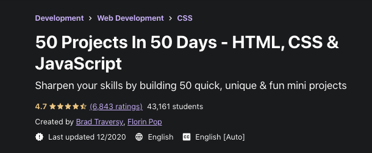

# Dad Jokes
___
See the live site [here](stephaniequintana.github.io/dad-jokes/).
## Project Description

The site generates dad jokes at the press of a button by utilizing `http request/response`, `await fetch` and the [icanhazdadjoke](https://icanhazdadjoke.com/) API.

## This project is an individual lesson from Brad Traversy's Udemy Course, [here](https://www.udemy.com/course/50-projects-50-days/) and the repository can be found [here](https://github.com/bradtraversy/50projects50days).

